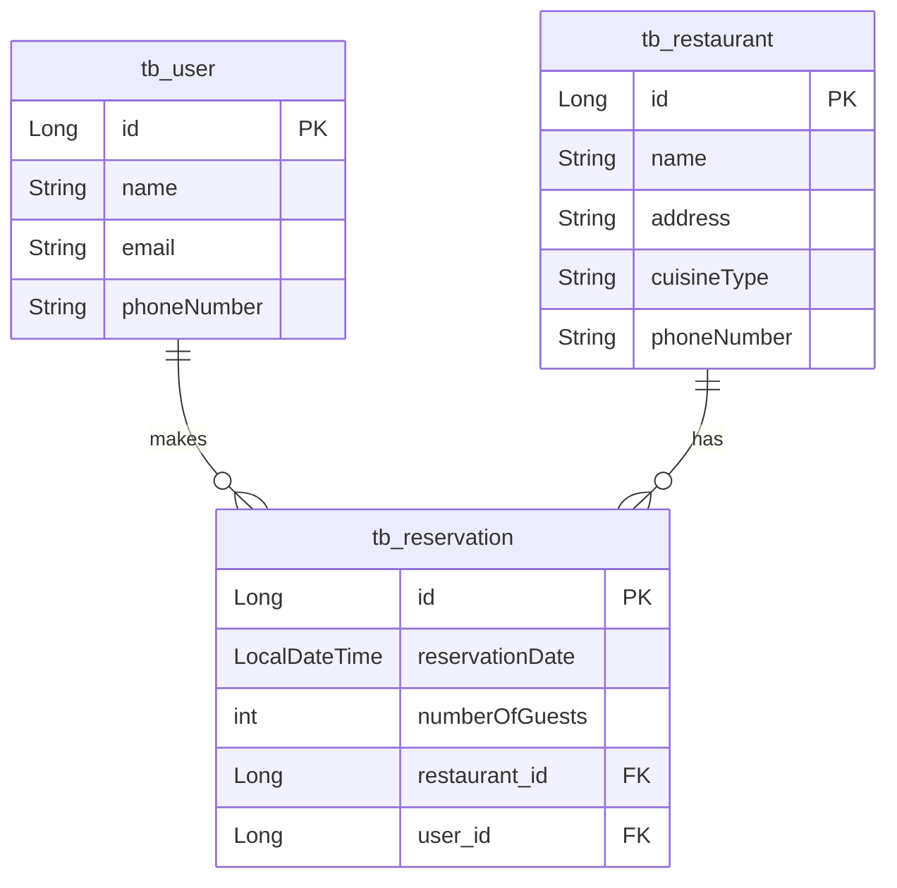

# API de Reserva de Restaurante para o BOOTCAMP GFT-DIO-JAVA

Esta API foi feita utilizando Java 17 + Springboot 3 com publicação CI/CD utilizando Railway.

Abaixo o diagrama do projeto:

```mermaid
erDiagram
    tb_user {
        Long id PK
        String name
        String email
        String phoneNumber
    }
    
    tb_restaurant {
        Long id PK
        String name
        String address
        String cuisineType
        String phoneNumber
    }

    tb_reservation {
        Long id PK
        LocalDateTime reservationDate
        int numberOfGuests
        Long restaurant_id FK
        Long user_id FK
    }

    tb_user ||--o{ tb_reservation : "makes"
    tb_restaurant ||--o{ tb_reservation : "has"

```
